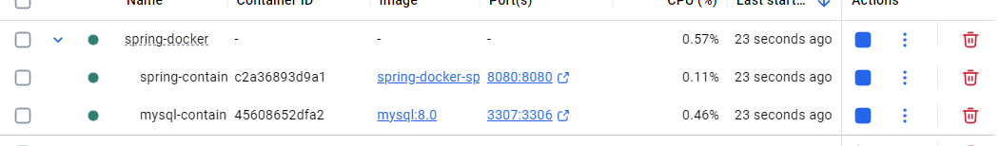

sử dụng docker compose để chạy mysql và spring ở 2 container
trong mysql dùng volume để lưu persistence data

chạy `docker-compose up --build` để chạy docker compose

API :

`/get` lấy các card đang có

`/create/{name}` tạo card với name

`/` test api