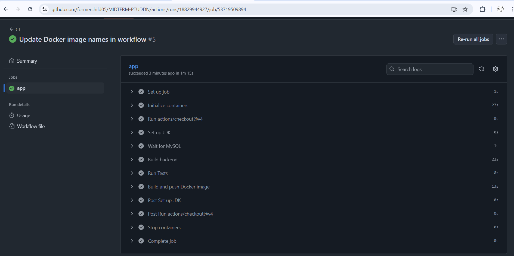
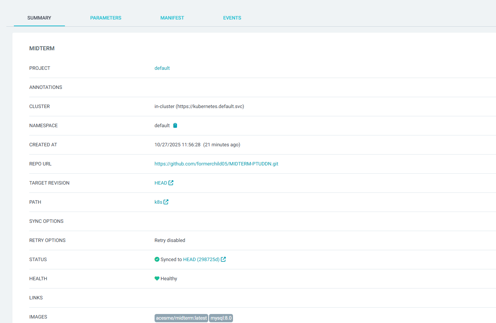
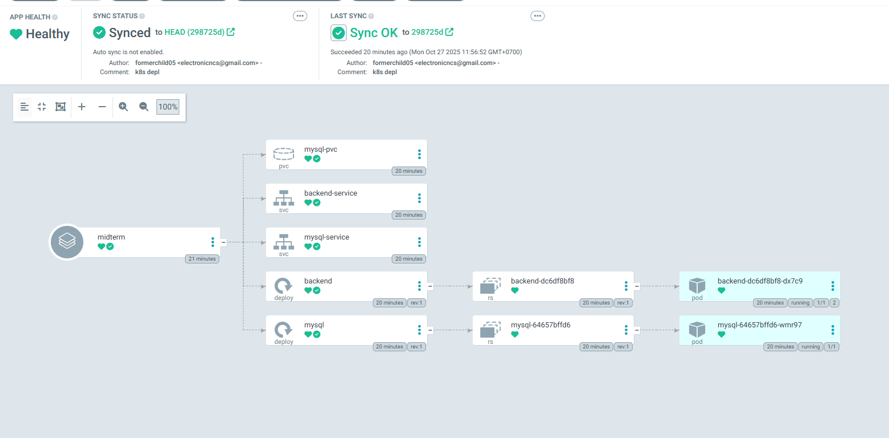
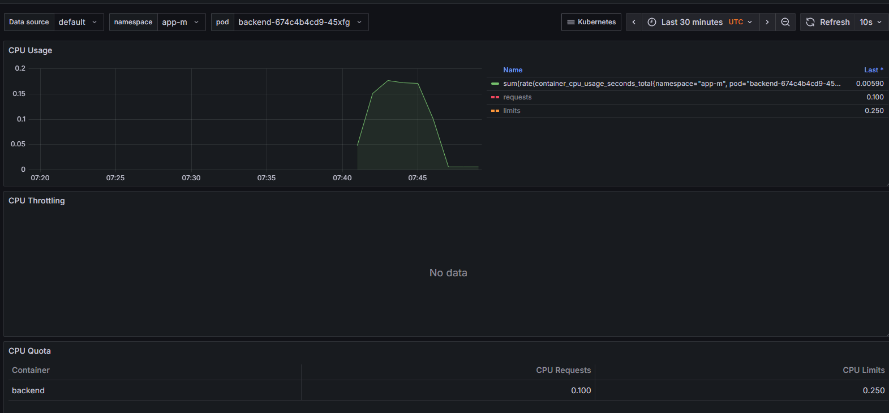
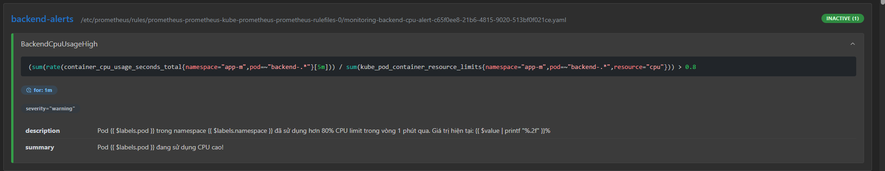
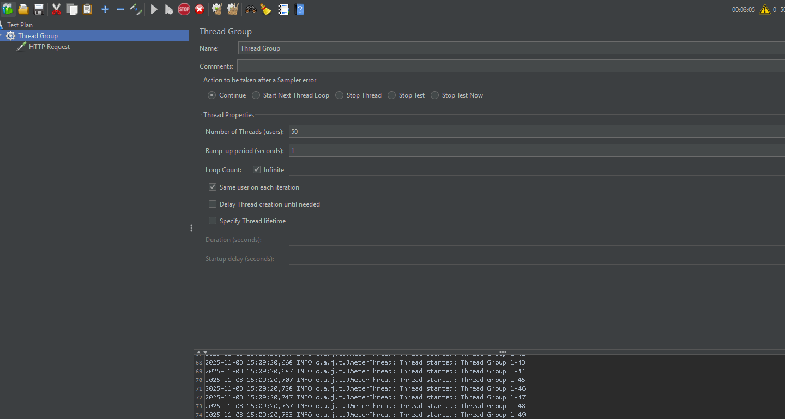
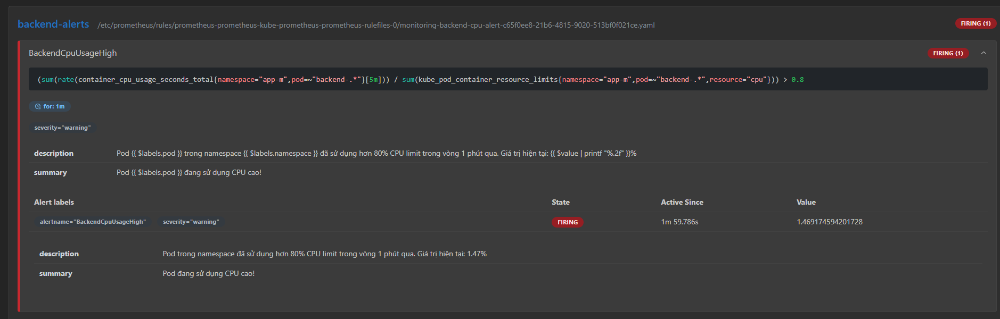

Mỗi khi push version mới của code github actions sẽ chạy CI và build image đẩy lên docker hub

Config argoCD

đợi pull image 

monitor app đã deploy

chạy `kubectl apply -f cpu-alert.yaml`

`kubectl create secret generic alertmanager-prometheus-kube-prometheus-alertmanager -n monitoring --from-file=alertmanager.yaml=alertmanager.yaml --dry-run=client -o yaml | kubectl apply -f -`
apply message slack

cho Jmeter chạy với 50 thread

alert chạy
